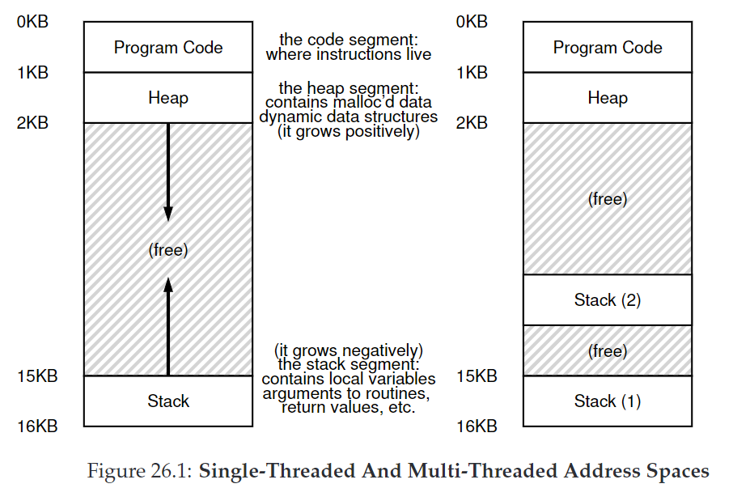

# 26. Concurrency: An Introduction

本章开始我们将介绍**并发（concurrency）**相关的知识。

我们为一个single running process引入一个新的抽象：**线程（thread）**。过去我们的观点是一个程序只有一个执行点（一个单独的PC取回并执行指令），现在我们引入**多线程（multi-threaded）**的概念，一个程序可以有多个执行点（有多个PC）。

* 每个线程可以看成一个分离的进程，但不同点在于：线程间共享同一块地址空间，因此可以访问相同的数据。
* 正如进程需要用PCB来保存状态，线程需要用\*\*thread control blocks（TCBs）\*\*来保存一个进程内每个线程的状态。与PCB的区别同样在于：地址空间不改变（不需要切换页表）
* 线程与进程的区别还在于：在多线程程序中，每个线程独立运行，栈不共用。因此存放栈数据的地方叫**thread-local** storage。我们不太用担心多个栈会溢出，除了一种特殊情况：递归。
  *

## 26.1 Why Use Threads?

使用多线程的好处：

1. **Parallelism：**并行地执行程序，提高速度。
2. 防止I/O阻塞：当一个线程在等待I/O完成，CPU可以调度它去做其他事。这种overlap of I/O within a single program 就像multiprogramming did for processes across programs。因此许多现代server-based应用都会利用线程。（web服务器、数据库管理系统等）

## 26.2 An Example: Thread Creation

我们在主线程依次创建线程A、B，可能的情况有：

* 创建A->运行A->创建B->运行B
* 创建A->创建B->运行A->运行B
* 创建A->创建B->运行B->运行A

我们很难知道哪个线程在哪个时候运行。

## 26.3 Why It Gets Worse: Shared Data

我们创建两个线程，在每个线程内调用同一个函数让全局变量循环加1，直至加10,000,000。然而最终结果并不是20,000,000，甚至是不确定的。

## 26.4 The Heart Of The Problem: Uncontrolled Scheduling

问题在于出现了**race condition（data race）**，结果取决于代码的执行时机，导致结果是**不定的（indeterminate）**。这样的代码叫做**critical section**：一段代码访问共享的资源，因此不能被多个线程并发执行。

我们想要的是让这段代码具有**互斥(mutual exclusion)**性质。

## 26.5 The Wish For Atomicity

我们希望指令具有**原子性（atomicity）**，即硬件不能在指令中间打断。当interrupt发生，指令只有run了和没run两个状态。将许多动作组合成一个原子动作叫做**transaction**。

我们需要硬件提供一些指令，在此基础上建立一系列**synchronization primitives**，联合OS的帮助来建立多线程系统。

CRUX：如何支持同步

## 26.6 One More Problem: Waiting For Another

一个线程必须等待另一个线程完成某些操作才能继续，后续的章节我们将学习支持多线程中sleeping/waking的机制。

## 26.7 Summary

并发中的四个关键名词。它们都由Dijkstra提出。

* A **critical section** is a piece of code that accesses a shared resource, usually a variable or data structure.
* A **race condition** (or **data race**) arises if multiple threads of execution enter the critical section at roughly the same time; both attempt to update the shared data structure, leading to a surprising (and perhaps undesirable) outcome.
* An **indeterminate** program consists of one or more race conditions; the output of the program varies from run to run, depending on which threads ran when. The outcome is thus not **deterministic**, something we usually expect from computer systems.
* To avoid these problems, threads should use some kind of **mutual exclusion** primitives; doing so guarantees that only a single thread ever enters a critical section, thus avoiding races, and resulting in deterministic program outputs.
