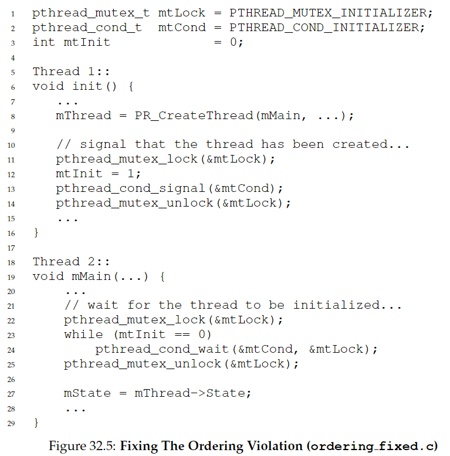
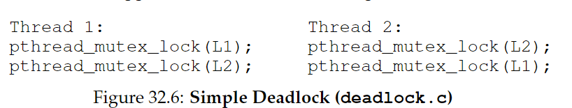
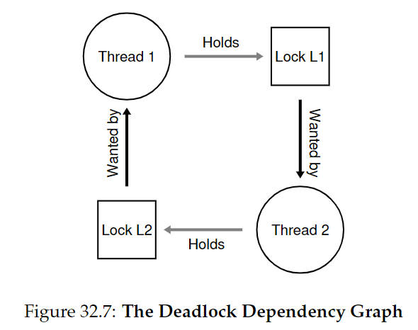

# 32.Common Concurrency Problems

并发任务会引发许多bug，分为死锁bug和非死锁bug。

CRUX：如何处理并发bug

## 32.2 Non-Deadlock Bugs

非死锁bug分为**违背原子性（atomicity violation）**bug**和违背顺序性（order violation)**bug。

### **Atomicity-Violation Bugs**：

如下图，若线程1判断proc\_info不为NULL并准备执行fputs操作时被打断，切换到线程2，将proc\_info置为NULL，又切换回线程1，导致fputs出错。


解决方案是加**锁**来保证操作的原子性：


### Order-Violation Bugs

如下图，线程2预设了mThread已经被初始化，然而若线程2先执行，会发生NULL-pointer dereference


为了保证内存访问的顺序不被反转，解决方案是使用**条件变量**：



## 32.3 Deadlock Bugs



上图是一个**可能**发生死锁的代码。当线程1拿到L1，然后上下文切换到线程2，线程2拿到L2，此时线程1和线程2都在等待对方释放手中的锁。



CRUX：如何处理死锁？

### Why Do Deadlocks Occur?

死锁为什么会发生？

* 在大型代码库中，组件间有复杂的依赖关系。
* 封装（**encapsulation**），隐藏了底层细节。

### Conditions for Deadlock

* **Mutual exclusion:** 线程宣称拥有它们所需资源的控制权（拿到锁）
* **Hold-and-wait:** 线程在等待额外资源时，已经持有被分配的资源。
* **No preemption:** 资源不能被强制移除。
* **Circular wait:** 存在线程循环链，每个线程持有的资源被下一个线程请求。

如果以上4个条件不满足，死锁就不会发生。因此下面来探讨防止死锁的策略。

### Prevention

#### Circular Wait

* total ordering: 给所有锁获得的顺序排序（如只有两把锁，规定先拿L1再拿L2）。
* partial ordering: 部分排序。在大型复杂系统中更常见。如Linux中的内存映射。
*   Tip：可以通过锁的地址来强制规定顺序

    ```c
    if (m1 > m2) { // grab in high-to-low address order
      pthread_mutex_lock(m1);
      pthread_mutex_lock(m2);
    } else {
      pthread_mutex_lock(m2);
      pthread_mutex_lock(m1);
    }
    // Code assumes that m1 != m2 (not the same lock)
    ```

#### Hold-and-wait

用一个大锁包住所有锁的获取，保证其原子性

```c
pthread_mutex_lock(prevention); // begin acquisition
pthread_mutex_lock(L1);
pthread_mutex_lock(L2);
...
pthread_mutex_unlock(prevention); // end
```

但是这个方案是有问题的。首先封装性导致我们不能确切地知道哪些锁应该提前获得；而且会降低并发性，因为锁会被提前获得，而不是真正需要它们的时候。

#### No Preemption

有时麻烦在于某个线程正在等待某个锁，然而它自己正拥有另一个锁。

使用trylock()来尝试获得某个锁，若目标锁未被持有则返回成功信息，否则返回错误。基于此可以来构建一个deadlock-free, ordering-robust lock acquisition protocol:

```c
top:
	pthread_mutex_lock(L1);
	if (pthread_mutex_trylock(L2) != 0) {
        pthread_mutex_unlock(L1);
        goto top;
    }
```

可能会出现**livelock**的情况，两个线程重复以上过程并重复地失败，这种情况极其罕见。解决办法是可以在重新循环时加一个随机的delay。

此外由于封装的问题，跳回开头的实现很复杂。

注意到这种办法并没有真正添加一个preemption（强制拿走一个线程的锁），而是使用trylock让一个线程放弃锁。

#### Mutual Exclusion

由于critical section的存在，我们不可能避免mutual exclusion。但是我们可以使用**lock-free**的办法，利用硬件指令构建数据结构，避免显式利用锁。（详见28节）

例如之前提到的CompareAndSwap方法：

```c
int CompareAndSwap(int *address, int expected, int new) {
    if (*address == expected) {
        *address = new;
        return 1; // success
    }
    return 0; // failure
}
```

```c
void AtomicIncrement(int *value, int amount) {
    do {
        int old = *value;
    } while (CompareAndSwap(value, old, old + amount) == 0);
}
```

这样我们就可以改写会导致race condition的代码：


### Deadlock Avoidance via Scheduling

如果我们知道全局信息，就可以采用提前调度的办法分配锁，来保证死锁不会出现。

不过这种办法应用场景有限，而且会限制并发性。

**Tom West's Law**: Don't always do it perfectly.

### Detect and Recover

如果出现死锁的情况很罕见，则可以允许它的存在，设置detector，当出现死锁重启系统。常见于数据库系统。
