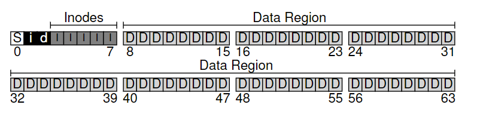
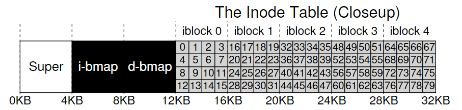
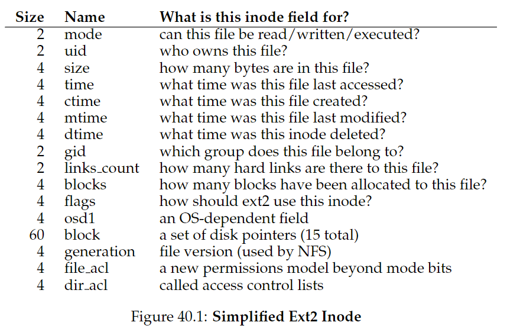
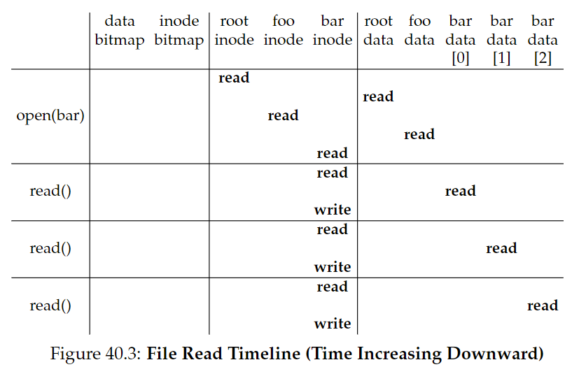
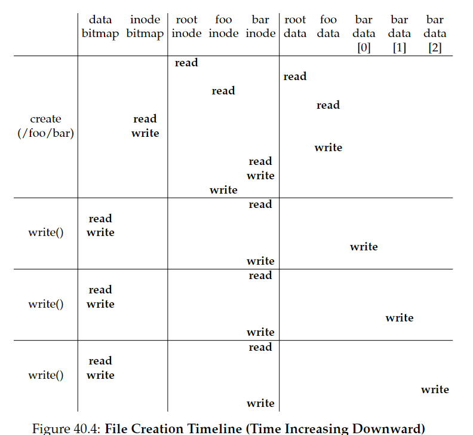

# 40. File System Implementation

CRUX：如何实现一个简单的文件系统？

## 40.1 The Way To Think

两个方面：

- 数据结构
- 访问方式

## 40.2 Overall Organization

一个简单的文件系统模型示意图：

存储空间被分为定长的block，其中存储用户数据的区域叫做**data region**。

- **inode**：记录文件的信息（元数据**metadata**）
- **inode table**：由inodes组成
- **allocation structures**：使用**bitmap**，每个bit用于指定对应的对象/块是free（0）or in-use（1）。
  - d: data bitmap
  - i: inode map
- S：作为**superblock**，包含特殊文件系统信息（例如inodes和data blocks个数、inode table起始地址、文件系统标识符等）。当挂载文件系统，OS首先读取S，初始化各种参数，然后将卷附加到文件系统数种。当访问卷中文件，系统将因此确切地知道去哪里寻找。

## 40.3 File Organization: The Inode

**inode**, short for **index node**(UNIX)。

每个inode被一个**i-number**(文件的**low-level name**)隐式引用。

inode block的sector address可以按如下公式计算：

每个inode内包含的信息如下：

其中最重要的是指向block的指针信息。一种简单方法是用一个或多个**direct pointers**(disk addresses)，指向文件所在的block。不过这种方法的局限性在于，一个文件的大小可能大于block大小乘指针个数。

### The Multi-Level Index

为了支持大型文件，可以使用**indirect pointer**，指向一个包含了更多direct pointer的block。还可以使用double甚至triple indirect pointer，以此构建multi-level index approach.

Linux ext2, ext3, UNIX文件系统都是使用**extents**而不是pointers。一个extent等于一个pointer加长度（以block为单位）。基于pointers的方法更灵活，但需要每个文件需要大量元数据（尤其对于大型文件）；基于extents的方法不那么灵活，但是更加紧凑，当磁盘上有足够空间并且文件可以连续排列时运行地很好。

## 40.4 Directory Organization

一个目录包含了一列（entry name，inode number）对。对于给定目录中的每个文件或目录，目录的data block中有一个字符串和一个数字。对于每个字符串，有一个它的长度。

每个entry包含一个inode number，record length（文件名的总字节数+任何剩余空间）和string length（实际文件名长度）。

删除一个文件，就会标记目录中一块inode number为0。也正因此我们需要使用record length：一个新entry会重用一块更大的entry，留下额外空间。

文件系统中，目录通常视为一种特殊的文件，它有一个inode（存在inode table中，标记为"directory"而不是“regular file”），inode指向data block。

这是一种简单的列表结构。在XFS中，目录的存储使用的是B-树，能够更快地创建文件（它不需要把整个list都扫描一遍来保证没有重名）。

**ASIDE: linked-based approaches**

另一种设计inode方法是使用linked list，每个inode只包含指向文件的第一个block。缺陷在于如果要读取文件的最后一块，或者执行随机访问，表现比较差。一个改进策略是**file allocation table（FAT）**，存储每一个data block的next指针。

### 40.5 Free Space Management

创建一个新文件时，文件系统会搜索bitmap，寻找空闲的inode，标记为used（1）。

在Linux ext2 and ext3中，会寻找一块连续的空闲空间，将其分配给新创建的文件。这种**pre-allocation**策略能够提高性能。

### 40.6 Access Paths: Reading and Writing

### Reading A File From Disk

从磁盘中读取文件的流程如图所示：

以打开/foo/bar为例：

1. 通过root inode number（在UNIX中，通常为2），打开根目录/.
2. 在根目录搜索foo
3. 在foo中搜索bar
4. 将bar的inode读进内存，FS检查permissions，在每个进程的open-file table中分配文件描述符，返回给用户。
5. 调用read()，读取文件。更新inode的最后访问时间，更新open-file table中的文件描述符，更新文件offset作为下次读取的起始点。
6. 文件关闭。

ASIDE：读操作不需要访问allocation structures

### Writing A File To Disk

写入磁盘需要分配block（除非是覆盖一块block），因此不仅要写数据到磁盘，还要先决定分配哪个block给文件，并更新其他结构（data bitmap, inode）：

一个写操作有5个I/O：

1. 读data bitmap（更新新分配的block为used）
2. 写bitmap（将其新状态reflect到磁盘）
3. 读inode
4. 写inode（更新新的block位置）
5. 写数据到block

创建一个新文件需要更多工作：

- 读inode bitmap（找到一个空闲inode）
- 写inode bitmap（标记为allocated）
- 写inode（初始化）
- 写数据到目录（链接high-level name和inode number）
- 读写目录的inode并更新

CRUX：如何减少文件系统I/O开销？

## 40.7 Caching and Buffering

读写文件引发的I/O开销很大，每打开一级目录都至少要两次读操作（读inode，读data）。

因此，绝大多数文件系统都会使用DRAM来缓存重要的blocks。

早期系统使用fixed-size cache，利用LRU算法存储热门的blocks。它们会在启动时被分配大概10%的内存。这是一种**static partitioning**，会导致浪费。

现代系统使用的是**dynamic partitioning**，将虚拟内存页和文件系统页整合进**unified page cache**，能更灵活地分配虚拟内存和文件系统。

对于写操作的**write buffering**好处：

- FS可以批量更新文件
- 系统可以调度后续I/O，提高性能。
- 通过delay避免一些写操作（创建了又删除）

现代FS通常缓存写入5-30秒。trade-off：缓存越久，性能越好，但会带来安全隐患（写入磁盘前系统崩溃）

因此对于数据库这样的应用，通常使用**direct I/O**接口（fsync()），或者使用**raw disk**接口直接避开文件系统。

