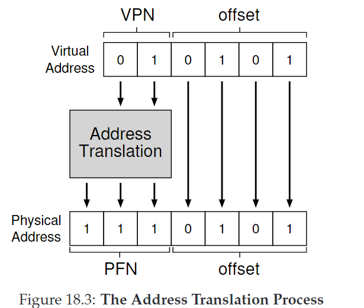
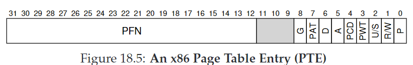
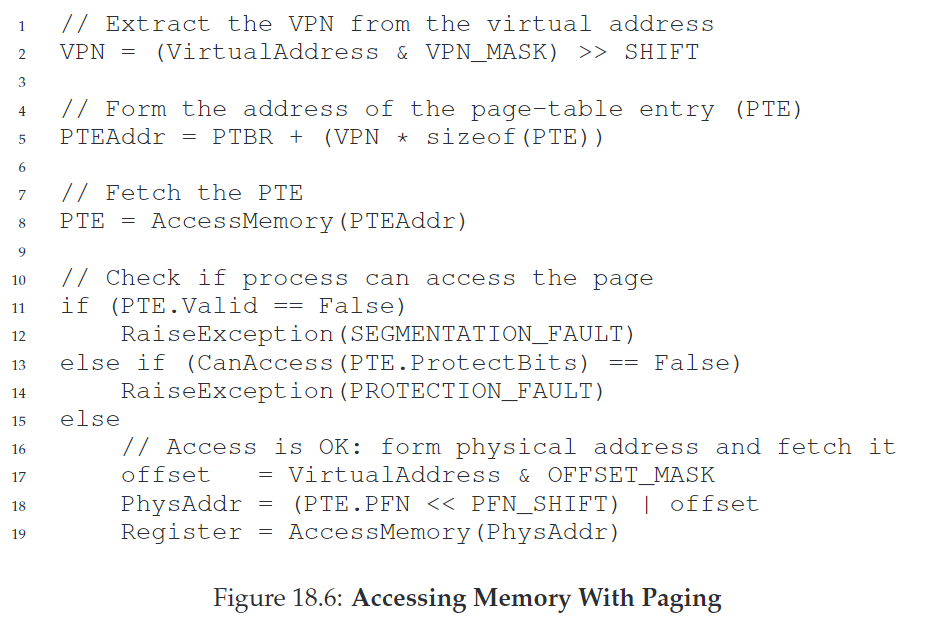

# 18. Paging: Introduction

segmentation方法切割了内存空间，导致空间碎片化。本章开始将介绍一种固定大小切割内存的方法，叫做**分页（paging）**。每一个固定大小的单元叫做**页（page）**，我们也因此把物理内存看成一个由固定大小的slots组成的数组，叫做**页帧（page frames）**。

CRUX：如何用页虚拟化内存？

## 18.1 A Simple Example And Overview

一块虚拟地址空间被划分成多个页，页通过预处理好的**页表（page table）转换成物理空间的地址。转换方式是利用virtual page number（VPN）**，转换成对应的**physical frame number（PFN）**，也叫**physical page number（PPN）**。下图是一个从64字节转换到128字节空间的例子：

&#x20;

注意offset并不会被转换。

&#x20;

## 18.2 Where Are Page Tables Stored?

page table很大，因此不会被储存在MMU中，而是存在OS虚拟内存中（甚至交换到disk中）。之后会进一步探讨。

## 18.3 What’s Actually In The Page Table?

* **valid bit:** 标识地址转换是否合法。未使用的地址被标记为invalid，触发trap。
* **protection bit：**标识页势在物理内存中还是在磁盘中。
* **dirty bit：**标识页是否被修改
* **reference bit(accessed bit)：记录页被访问的次数。用于page replacement**

下图是x86中一个page table entry例子：

&#x20;

P：present bit；R/W：read/write bit；U/S：user/supervisor bit；PWT,PCD,PAT,G：hardware caching；A：accessed bit；D：dirty bit；PFN：page frame number

注意x86中没有valid bit。当P=1表示present and valid；当P=0，表示not present，由OS利用额外的结构决定是否valid

## 18.4 Paging: Also Too Slow

实际存储：virtual adress： 32 = 20(VPN)+12(offset)；PTE: 32 = 20(PFN)+3(empty)+9(flag)。

&#x20;

对于每一个内存引用，paging需要执行额外的内存引用来从page table中取回转换的地址。这需要大量的工作。由此带来了时间和空间问题。
