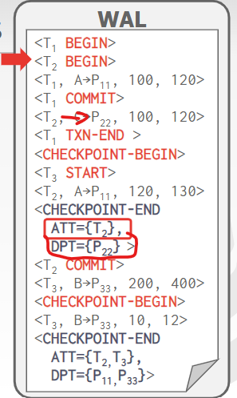

# #15: Concurrency Control Theory

DBMS的并发控制(concurrency control)与恢复组件(recovery components)贯穿了整个架构设计

.png>)

Motivation：

* 同一时刻改变表的一条记录，如何避免race condition？
  * Lost Updates, Concurrency Control
* 转账100$，突然断电了，数据库正确的状态应该是？
  * Durability, Recovery

## Transactions

> A **transaction** is the execution of a sequence of one or more operations (e.g., SQL queries) on a database to perform some higher-level function.

事务是DBMS的基本执行单元。

Example：从A的银行账户中转账100$到B的账户中。

事务：

* 检查A是否有100$
* 从A的账户中扣除100$
* 给B的账户增加100$

### Strawman System

一条条顺序执行每个事务，每次只能有一个事务在被执行。

在事务开始前，复制整个数据库，对副本文件做修改。如果事务成功，覆盖原文件。否则删掉dirty copy

#### Problem Statement

我们希望并发地执行独立的事务。为什么？

* 更高的利用率(utilization)、吞吐量(throughput)
* 降低对用户响应时间

但我们也希望：

* 正确性(Correctness)
* 公平性(Fairness)

如果我们任意地把操作交织在一起，会导致：

* 临时的不一致（不可避免）
* 永久的不一致（bad！）

我们需要一种正式的正确性标准来判断操作的交织是否合法。

一个事务对数据库里的数据可以有很多操作，但DBMS只关心什么数据被读/写。外部世界的改动超出了DBMS的认知范围。

### Transactions In SQL

一个事务由**BEGIN**命令开始

由**COMMIT**或**ABORT**终止：

* 如果commit，DBMS保存事务的所有改动，或者abort掉
* 如果abort，所有的改动被撤销(undo)，好像事务从来没被执行过。

abort操作既可以是self-inflicted，可以是由DBMS发起的。

### Correctness Criteria: ACID

* **Atomicity**: “all or nothing”
* **Consistency**: “it looks correct to me”
* **Isolation**: “as if alone”
* **Durability**: “survive failures”

## Atomicity

执行一个事务，只有两种可能的结果：

* 所有操作完成后commit
* 执行一些操作，abort

DBMS保证事务是原子的(**atomic**)

从用户的角度看：事务要么执行完所有操作，要么根本没执行

#### Mechanisms

**Approach #1: Logging**

* DBMS给所有操作记日志，以便undo来abort掉事务
* 在内存和磁盘中都维护undo记录
* 就像飞机的黑匣子一样

Logging几乎被所有DBMS采用

* 审计追踪
* 效率

**Approach #2: Shadow Paging**

* DBMS创建页的副本，事务对副本操作。只有commit才让页对用户可见。
* 起源于System R

只有很少的系统用这种方式：CouchDB，LMDB(OpenLDAP)

## Consistency

数据库表示的世界是逻辑上正确的。对数据库数据的问题的答案是逻辑上的正确答案。

* Database Consistency：数据库正确地反映真实世界。未来的事务能看得见过去事务的影响。
* Transaction Consistency：如果数据库在事务开始前是一致的，那么事务结束后也应该是一致的。这点是应用程序的责任，DBMS控制不了。

## Isolation

用户提交了事务，每个事务好像是只有自己在当前时刻独立运行。(run one-at-a-time)

但是DBMS实际上实现了并发，让各种事务的读写操作交织在了一起。

#### Mechanisms:

并发控制协议(**concurrency control protocol**)决定着DBMS如何恰当地交织操作。有两类协议：

* **Pessimistic**：悲观的。在第一时间就不让问题出现。
* **Optimistic**：乐观的。假设冲突很罕见，只在出现问题时才处理。

#### Example:

假设A、B各有$1000，有这样两个事务并发执行：

.png>)

正确结果既可以是T1先执行，T2后执行，得到A=954，B=1166

也是可以是T2先执行，T1后执行，得到A=960，B=1160。

由于是并发执行的，没法保证谁先执行。但结果AB账户余额之和必须是2000\*1.06=2120，让两个事务看起来是串行(serially)的。

.png>)

我们想要让两个事务交织在一起执行，充分利用并发性（低磁盘/网络 I/O；多核CPU）。当某个事务因为某个资源的问题（比如page fault）停滞(stall)了，另一个事务能继续推进。

一个good example如下：

.png>)

而一个bad example如下：

.png>)

对应数据库的读写操作：

.png>)

**如何判断一种调度是否正确？**

如果它等价(equivalent)于串行执行(serial execution)。

几个概念：

* 串行调度(Serial Schedule)：不同的事务间是不交织的
* 等价调度(Equivalent Schedule)：执行一种调度的效果等同于另一种调度执行的效果。不关心算数操作是什么。
* 可串行化调度(Serializable Schedule)：一种等价于某种串行调度的调度。

如果每个事务保持一致性，那么每个可串行化调度也保持一致性。

串行化并不那么直觉上的正确，但是基于DBMS更多灵活性，而更多的灵活性意味着更好的并行性。

### Confilicting Operations

两个操作产生冲突的条件：

* 来自不同的事务
* 作用于同一个对象，且至少其中一个为写操作。

冲突类型：

* 读-写冲突（**R-W**）
* 写-读冲突（**W-R**）
* 写-写冲突（**W-W**）

#### Unrepeatable Reads 不可重复读

读-写冲突（**R-W**）

#### Read Uncommited（Dirty Reads） 读未提交（脏读）

写-读冲突（**W-R**）

.png>)

#### Overwriting Uncommitted Data 覆盖未提交

写-写冲突（**W-W**）

.png>)

知道了这些冲突，我们就可以理解schedule的可串行化意味着什么，以此**检查**schedule是否正确。但这不意味着我们能够提前规划好一个正确的schedule。

有两个等级的serializability：

* Conflict Serializability（绝大多数DBMS支持）
* View Serializability（没有DBMS支持）

### Serializability

#### Conflict Serializability

对于schedule S，如果可以通过交换来自不同事务、连续但不冲突的操作，转换成一个serial schedule，意味着它是confilct serializable的。

.png>)

例如对于上图，通过一系列交换，可以得到一个serial schedule：

.png>)

但对于下图，由于W(A)和W(A)冲突，不能得到serial schedule，因此不是confilct serializable的

.png>)

如果schedule中只有两个事务，交换操作是很容易的。但如果有多个操作就很费劲。一种更快的算法是用依赖图（**dependency graphs**）：

如果某两个事务的操作出现冲突，则在两个节点间画一条依赖边，先发起操作的指向后发起操作的。一个schedule是conflict serializable当且仅当它的依赖图是无环图。

例1不是conflict serializable的，因为出现了环

.png>)

例2是conflict serializable的，可以转换成T2,T1,T3串行

.png>)

例3出现了环，但事实上它是conflict serializable的。虽然出现了W(A)-R(A)和R(B)-W(B)冲突，但实际上不影响结果。

.png>)

#### View Serializability

View Serializability是一种更weaker的serializability，允许更多的schedules。但很难实现。

.png>)

注意，两种定义都不能让所有的schedule被认为是“serializable”，因为它们并不能理解操作的数据的意义。（如上面的例3）

In practice，**conflict serializability**被广泛使用，因为它易于实现。特殊的case会单独在应用程序的层面上被处理。

#### Universe Of Schedules

.png>)

## Durability

所有提交了的（committed）事务必须是持久的（persistent）

* 没有只更新了一半的更新
* 没有来自失败事务的改动

DBMS可以用logging或者shadow paging来保证改动是持久的（durable）

## Conclusion

并发控制和恢复是DBMS可提供的最重要的功能。

并发控制是自动的

* 系统自动插入上锁/解锁请求，调度不同事务的活动
* 保证执行结果等价于事务一个接一个执行。

