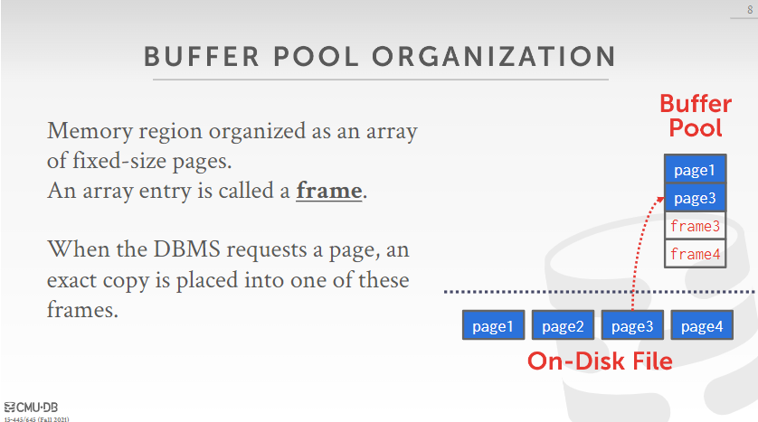
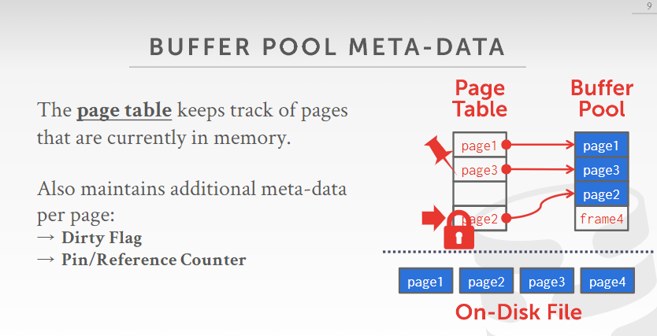

# Project #1 - Buffer Pool

第一个项目是实现一个基于LRU算法的buffer pool。

## OVERVIEW



文件在内存中按固定大小的**页(page)形式存储，组成一个数组，数组的每个entry称为一帧(frame)**。当DBMS请求一个页时，会把这个页放到buffer pool的一帧中。



每一个buffer pool实例有一个对应的page table来管理页的存储，即一个以page id为key，frame id为value的hash map。只要外部提供page id，就可以O(1)时间找到对应页在buffer pool中的位置。

page table还负责维护一些页的元数据：

* **Dirty Flag:** 用于表示该页是否被写过
* **Pin/Reference Counter:** 引用计数。当某页被引用，这个值+1，表示改页正在被使用；当该页被取消引用，这个值-1.若pin counter的值为0，表明该页允许被替换。

## TASK #1 - LRU REPLACEMENT POLICY

第一个任务是实现`LRUReplacer`，它作为`BufferPoolManagerInstance`下的一个成员，来管理可以被替换的页。LRU算法的具体实现就是实现一个LinkedHashMap。不过这里可以采用一个list和一个unordered\_map。其中list用于存放可被替换的页帧号，unordered\_map用于存放（页帧号，页在list中的位置）的键值对。

```cpp
// /src/include/lru_replacer.h
class LRUReplacer : public Replacer {
 public:
  // ...
  bool Victim(frame_id_t *frame_id) override;
    
  void Pin(frame_id_t frame_id) override;
    
  void Unpin(frame_id_t frame_id) override;

  size_t Size() override;

 private:
  // TODO(student): implement me!
};
```

添加如下私有变量：

```cpp
std::mutex mutex_;
std::list<frame_id_t> lru_list_;
std::unordered_map<frame_id_t, std::list<frame_id_t>::iterator> lru_map_;
size_t max_size_;
```

方法实现：

`bool LRUReplacer::Victim(frame_id_t **frame_id*)`：

替换页。 如果list为空，返回false； 否则取出其中最后一项，即被替换的页帧号，将它从list和map中都删除，返回true。

`void LRUReplacer::Pin(frame_id_t *frame_id*)`

Pin住一个页，表明该页被引用，不能被替换。 搜索map，如果没找到直接return； 如果找到将它从list和map中删除。

`void LRUReplacer::Unpin(frame_id_t *frame_id*)`

Unpin一个页，表明取消该页的引用，成为被替换的candidate。 搜索map，没找到直接return； list大小大于max\_size\_，直接return； 加在list头部，在map中添加对应键值对。

`size_t LRUReplacer::Size()`

Literally.

为保证thread safe，方法内要加`std::scoped_lock lock(mutex_)`范围锁。

## TASK #2 - BUFFER POOL MANAGER INSTANCE

任务2是实现`BufferPoolManagerInstance`，首先看一下需要用到的几个私有成员：

`Page *pages_`：buffer pool中页组成的数组。

`DiskManager *disk_manager_`：负责读写磁盘中的页。

`std::unordered_map<page_id_t, frame_id_t> page_table_`：页表，存储（页号，帧号）的键值对。

`Replacer *replacer_`：即Task1中实现的`LRUReplacer`，负责替换页。

`std::list<frame_id_t> free_list_`：磁盘上空闲页（的帧号）组成的list

**注意**：`Page`只是表示buffer pool，也就是内存中的一块存储空间。而`page_id`表示的是物理页的页号。

方法实现：

`Page *BufferPoolManagerInstance::FetchPgImp(page_id_t page_id)`：

给定page id取页

1. 用`page_id`查页表，找对应`frame_id`
   1. 若存在，利用`frame_id`从`pages_`数组找到对应页，`pin_count`自增，让replacer pin住该页，返回页。
   2. 若P不存在，即请求页不在buffer pool中，先从free list中找。
   3. 如果没找到，让replacer为我们替换出一张页，若替换出的页是脏页，让disk\_manager将它写入磁盘。最后将被替换页从页表中擦除。
   4. 如果替换失败，返回nullptr
2. 更新这个页的元数据（id, pin\_count, is\_dirty\_），重置内存。
3. 把页加入页表，让disk\_manager读取页，让replacer pin住页。
4. 返回页。

`bool BufferPoolManagerInstance::UnpinPgImp(page_id_t page_id, bool is_dirty)`：

Unpin一张页

1. 用`page_id`查页表，若没查到，直接返回false。
2. 如果查到的页pin count小于等于0，直接返回false。
3. 页的pin count自减。
4. 如果参数`is_dirty`为true，把页的`is_dirty_`属性也改为true。
5. 让replacer unpin这张页
6. 返回true。

`bool BufferPoolManagerInstance::FlushPgImp(page_id_t page_id)`：

将给定page id的页刷入磁盘，不多赘述。注意调用disk\_manager的`WritePage`方法，并将对应页的`is_dirty_`属性置否。

`void BufferPoolManagerInstance::FlushAllPgsImp()`：

将buffer pool中所有页刷入磁盘，遍历页表即可。

`Page *BufferPoolManagerInstance::NewPgImp(page_id_t *page_id)` ：

创建一张新页到buffer pool中，`page_id`是out parameter，存放新创建的page id。方法实现类似`FetchPgImp`。

1. 如果free list不为空，优先从free list中取一张页。
2. 否则让replacer为我们替换出一张页，并`WritePage`和从页表中`erase`。
3. 调用`AllocatePage()`，生成一个新的page id。
4. 更新页的元数据、重置内存。
5. 加入页表、Pin
6. 返回新page

`bool BufferPoolManagerInstance::DeletePgImp(page_id_t page_id)`：

从buffer pool中删除给定page id的页

1. 查表，若不存在直接返回true。
2. 若查到的页的pin count不为0，说明该页正在被引用，不能删除。返回false。
3. 调用`DeallocatePage(page_id)`、重置元数据、重置内存。
4. 放入free list尾部
5. 返回true

以上方法内注意上latch

## TASK #3 - PARALLEL BUFFER POOL MANAGER

如果只有一个buffer pool，由于需要上latch来保证thread safe，会导致效率低下。因此考虑使用多个buffer pool并行，每个实例有自己的latch。

在头文件中添加如下成员变量：

```cpp
/** Index of next BPMI to be added */
std::atomic<size_t> next_manager_index_;
/** Number of individual BPMIs*/
size_t num_instances_;
/** Size of every buffer pool */
size_t pool_size_;
/** Array of BPMIs */
std::vector<BufferPoolManagerInstance *> managers_;
```

在`NewPgImp`方法中，使用round robin方法给新页分配它的buffer pool manager，即从下标0到最大值，再回到0。因此需要维护一个成员变量`next_manager_index_`，来指定下一个被分配的manager的index。考虑到并发性，这个变量更改的操作必须是原子的，因此采用`atomic<size_t>`类型。

其他方法，如Fetch, Unpin等，只要调用对应manager下的方法即可（这些方法不用上锁，因为子方法已经上过了）。
