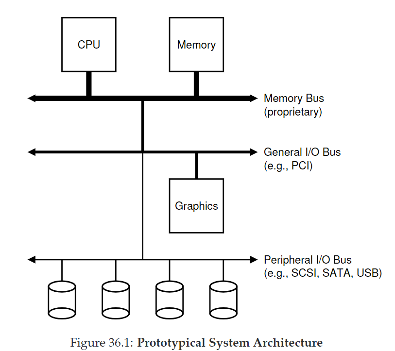
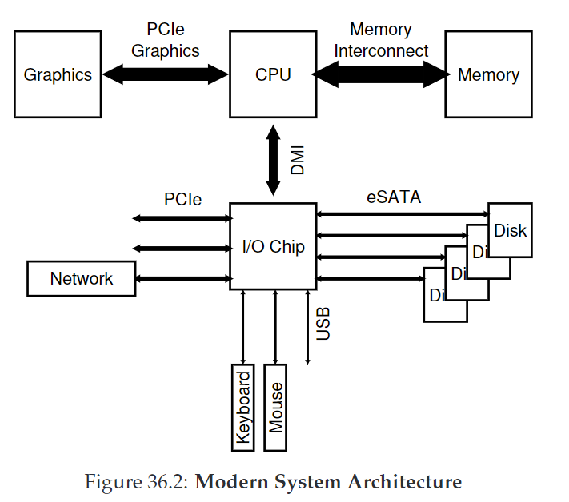
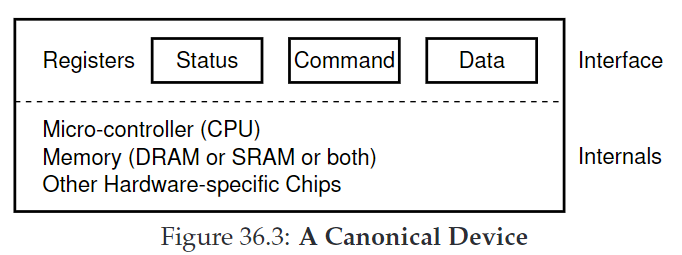
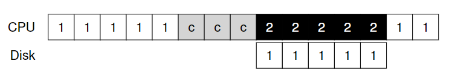
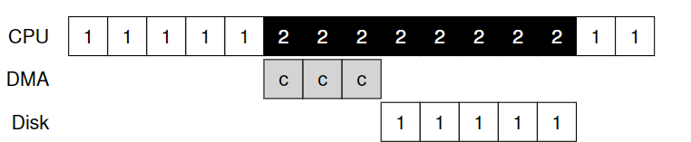
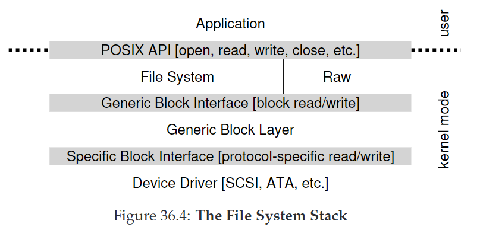
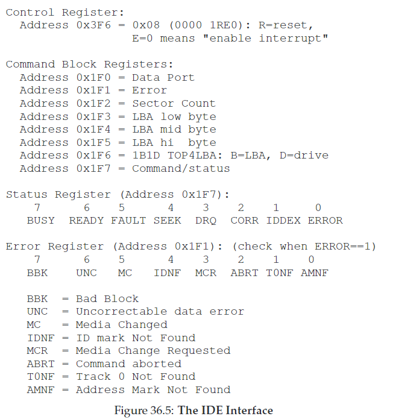

# 36. IO Devices

CRUX：如何整合I/O进入系统？

## 36.1 System Architecture

原型系统架构：



现代系统使用专门的芯片组和快速的点对点连接来提高性能：



## 36.2 A Canonical Device

标准设备示意图：



* **接口（interface）**：由硬件提供，允许系统软件控制操作
* **内部结构**：不同的设备组成不同。

## 36.3 The Canonical Protocol

* status：当前设备状态
* command：告诉设备执行哪个任务
* data：传递数据到设备，或从设备获得数据

```clike
While (STATUS == BUSY)
	; // wait until device is not busy
Write data to DATA register
Write command to COMMAND register
(starts the device and executes the command)
While (STATUS == BUSY)
	; // wait until device is done with your request
```

协议有四步：

1. **polling** the device: OS重复读取status寄存器，直到设备准备好接收命令。
2. **programmed I/O(PIO)**: OS发送数据到data寄存器。
3. OS写入一条命令到command寄存器。
4. OS循环polling，等待设备完成。（获得error码）

这个协议并不高效，因为polling的过程可能浪费大量CPU时间。

CRUX：如何避免polling的开销？

## 36.4 Lowering CPU Overhead With Interrupts

利用**中断（interrupt）机制，发起I/O请求时让当前进程睡眠，上下文切换到其他进程运行。当设备完成I/O，抬起硬件中断，让CPU跳转到OS预设的interrupt service routine(ISR)或interrupt handler**，唤醒等待I/O的进程。

但中断并非永远是最佳解决方案：

* 频繁的中断会带来额外的开销，因此最好使用hybrid方法：先poll一会，如果还没好再用中断。
* 在网络中，当大量传入的数据包流都产生一个中断，可能引发**livelock**: OS持续处理中断而用户进程无法运行。
* 一个优化策略是**coalescing**: 设备在发起中断前先等待，等待时若其他请求可能很快就完成，可以把许多中断合并为一个中断传递，降低开销。

## 36.5 More Efficient Data Movement With DMA

向设备中写入数据时，CPU需要先将内存中的数据拷贝一份（如下图中的c）



当数据较大时，CPU负担会比较重。

解决方案是使用**Direct Memory Access（DMA）**，要转移数据到设备时，OS告诉DMA数据在哪、怎么拷贝、发送到哪，然后OS就可以去处理其他事情。当DMA完成，抬起interrupt。



## 36.6 Methods Of Device Interaction

CRUX：OS如何与设备通信？

* **I/O instructions: OS发送数据到指定设备寄存器。在x86中的 in 和 out 指令。要发送一条数据到设备，caller需指定寄存器、数据和设备特定的端口。这种指令是privileged**。
* **memory-mapped I/O:** 将设备寄存器作为内存地址。OS发起加载（读）或存储（写）地址，硬件将加载/存储路由到设备。

这两种方法无优劣之分，在今天都被使用。

## 36.7 Fitting Into The OS: The Device Driver

不同的设备有不同的接口，如何让OS来适配这些接口？

CRUX：如何构建设备中立的操作系统？

解决办法是**抽象（abstraction）**，OS底层中有一块**device driver**，封装着任何种类的设备交互。

如下图所示是Linux中的文件系统栈结构：



## 36.8 Case Study: A Simple IDE Disk Driver



如上图是IDE disk driver的接口，它的基础协议如下：

* **等待驱动就绪**：读取Status寄存器（0x1F7），直到驱动为READY且not BUSY.
* **向命令寄存器写入参数：**将扇区数、要访问的扇区逻辑块地址（LBA）、驱动编号（master=0x00或slave=0x10）写入command寄存器（0x1F2-0x1F6）。
* **开始I/O：**向command寄存器写入READ—WRITE命令。
* **数据传输(for writes)：**等待驱动status为READY且DRQ（drive request for data）；将数据写入数据端口。
* **处理中断：**简单情况下，为每一个传输的扇区处理一个中断；复杂情况下允许分批处理，在所有传输完成后处理一个最终中断。
* **错误处理：**在每个操作后，读取status寄存器。如果发现ERROR bit，读取error寄存器for details。
