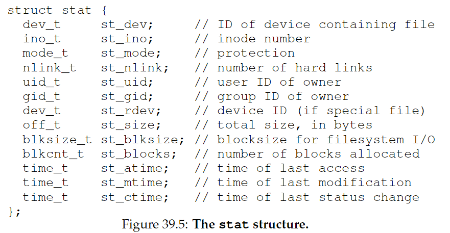
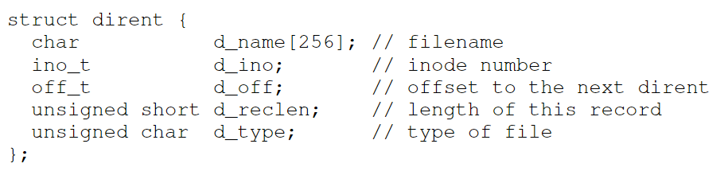

# 39. Interlude: Files and Directories

**persistent storage**: **hard disk drive** or **solid-state storage device**.

CRUX：如何管理持久化设备？

## 39.1 Files And Directories

**文件（file）**是一个线性的字节数组，每个文件都有一个**low-level name**，通常叫做**inode number**。

**目录（directory）**也有相应的low-level name，但是它的内容是一系列键值对（user-readable name - low-level name）。目录可以放在目录中，以此搭建任意的**directory tree**(or **directory hierarchy**)。

目录结构从**根目录（root directory）**起（在基于UNIX系统中，根目录是 / ），用**分隔符（separator）**来为子目录命名。引用一个文件时，可以用它的绝对路径名（**absolute pathname**），例如/foo/bar.txt。

一个文件名有两个部分，例如bar和txt，用句号(.)隔开，前者是任意的文件名，后者表示文件的type。不过这通常只是一种惯例，例如并不是说main.c就一定是C文件。

## 39.2 The File System Interface

下面来介绍文件系统的接口：

### Creating Files

```c
int fd = open("foo", O_CREAT|O_WRONLY|O_TRUNC, S_IRUSR|S_IWUSR);
```

- 参数1：文件名
- 参数2：创建模式
  - O_CREAT：若文件不存在，创建它
  - O_WRONLY：文件只能被写入
  - O_TRUNC：如果文件已存在，裁减至0字节，从而删除现有内容
- 参数3：指定权限（可读|可写）

open()的返回值是一个**文件描述符（file descriptor）**，是一个整数，每个线程私有，在UNIX系统中用于访问文件，是一个**capability**，给予用户执行某些操作的权限。也可以看作指向文件的指针，可使用read()和write()这样的”方法“。

### Reading And Writing Files

```shell
prompt> echo hello > foo
prompt> cat foo
hello
prompt>
```

在Linux系统中，我们可以用**strace**来追踪一个系统调用。下面我来看看读取foo时发生了什么。

```shell
prompt> strace cat foo
...
open("foo", O_RDONLY|O_LARGEFILE) 				= 3
read(3, "hello\n", 4096)					 	= 6
write(1, "hello\n", 6) 							= 6
hello
read(3, "", 4096) 								= 0
close(3) 										= 0
...
prompt>
```

1. 首先用open()打开foo文件，O_RDONLY表明只允许读，O_LARGEFILE指定使用64-bit offset。调用成功返回文件描述符，值为3。这个值是固定的，因为每个进程已经有了3个打开的文件.（0：标准输入，1：标准输出，2：标准错误）
2. 调用read()，第一个参数为文件描述符，第二个参数指向放置读取结果的buffer，第三个参数为buffer的大小。read()调用成功，返回读取的字节数6
3. 调用write()，第一个参数为文件描述符1，即标准输出。注意如果不是高度优化，cat调用的是库例程 printf()
4. cat继续尝试读取，但是没有读到。返回0.
5. 调用close()，传入fd，关闭文件。

### Reading And Writing, But Not Sequentially

```c
off_t lseek(int fildes, off_t offset, int whence)
```

使用`lseek`可以从任意的offset开始读写。

第三个参数whence指定seek的方式：

- SEEK_SET: offset设置为offset bytes
- SEEK_CUR: offset设置为当前位置+offset bytes
- SEEK_END: offset设置为文件大小+offset bytes


### Shared File Table Entries: fork() And dup()

每个进程维护一组文件描述符，每个文件描述符指向系统中**open file table**中的一个entry，每个entry记录了底层文件的描述符、当前的offset和其他相关细节（例如文件是否可读、可写）

多数情况下，文件描述符和open file table中的一个entry是one-to-one mapping。当多个进程访问同一个文件时，每个逻辑文件是独立的，有自己当前的offset。

但有时open file table中的entry也可以是共享的：

- fork()，创建的child进程访问与parent进程相同的entry。可用于多进程合作执行同一个任务，写入相同的输出文件而不需要额外协调。

- dup()，包括dup2()和dup3()，允许一个进程创建一个新的fd，指向一个已经打开的文件的fd。常用于UNIX shell中的redirection。

  - e.g.下面这个段代码将printf输出的内容从标准输出（1）重定向到hello.txt（fd）。

    ```c
    int fd = open("hello.txt", O_APPEND|O_WRONLY);
    dup2(fd,1);
    printf("hello world\n");
    ```

### Writing Immediately With fsync()

write()操作并不是立即写入，而是先将内容写入缓存区buffer，在之后某个时间点再写入存储设备。

使用fsync()可以立即写入，强制所有dirty data（modified but not yet written）写入磁盘，当所有写操作完成后返回。

```c
int fd = open("foo", O_CREAT|O_WRONLY|O_TRUNC,
S_IRUSR|S_IWUSR);
assert(fd > -1);
int rc = write(fd, buffer, size);
assert(rc == size);
rc = fsync(fd);
assert(rc == 0);
```

### Renaming Files

文件重命名（UNIX中的`mv`）使用的system call是`rename(char*old, char *new)`，这个操作必须是原子的。

它对与需要原子更新文件状态的操作也是至关重要的。例如对于foo.txt，我们在编辑器中插入一行话，编辑器会进行类似如下操作：

```c
int fd = open("foo.txt.tmp", O_WRONLY|O_CREAT|O_TRUNC,
S_IRUSR|S_IWUSR);
write(fd, buffer, size); // write out new version of file
fsync(fd);
close(fd);
rename("foo.txt.tmp", "foo.txt");
```

首先将包括新的一行的文本内容临时写入foo.txt.tmp（使用fsync()），当确定保存，将foo.txt.tmp改名为foo.txt，并同时并发地删除旧版本。

### Getting Information About Files

文件存储时的信息叫做**元数据（metadata）**，使用stat()或fstat()可以查看这些信息。




### Removing Files

UNIX中使用`rm`删除文件，调用的是unlink()接口


### Making Directories

创建目录调用mkdir()接口，一个新创建的目录包含两个entry：一个指向它自己（“.”），另一个指向它的parent目录（“..”）。

```shell
$mkdir foo
$cd foo
$ls -a
./ ../
$ls -al
total 4
drwxr-xr-x 1 10165 197609 0 Dec 27 19:03 ./
drwxr-xr-x 1 10165 197609 0 Dec 27 19:03 ../
```


### Reading Directories

`ls`使用opendir()的打开目录，readdir()读取目录，closedir()关闭目录

每个目录的entry的数据结构如下：



可以添加`-l`flag来获得目录的详细信息

### Deleting Directories

`rmdir`删除目录，调用rmdir()，这个操作很危险，因此只有当目录为空（只包含"."和".."）时才能调用。


### Hard Links

`ln`调用link()，将一个文件名映射到一个inode，同一个inode可以有多个human-readable name，例如：

```shell
prompt> echo hello > file
prompt> cat file
hello
prompt> ln file file2
prompt> cat file2
hello
```

使用`-i`flag输出inode number:

```shell
prompt> ls -i file file2
67158084 file
67158084 file2
prompt>
```

当创建一个新文件时，实际上做了两件事：

1. 创建一个结构（inode），记录文件相关信息
2. 将一个human-readable name链接到那个inode


之前我们提到删除一个文件时调用了unlink()。它会删除文件名与inode的链接，并检查inode的**reference count（link count）**，将其减一，如果值减为零，则会释放掉这个inode和相关数据块，从而”删除“文件。


### Symbolic Links

之前的link()建立的是硬链接，它有一些限制：不能链接到一个目录（防止创建循环）；不能链接到其他磁盘分区的文件（inode number只在每个特定文件系统中是唯一的）

下面将介绍**symbolic link**，也叫**soft link**。建立这种链接只需要在link()后加`-s`flag。

```shell
prompt> echo hello > file
prompt> ln -s file file2
prompt> cat file2
hello
```

- symbolic link实际上是一个不同类型的文件：

  ```shell
  prompt> stat file
  ... regular file ...
  prompt> stat file2
  ... symbolic link ...
  ```

- 它的大小与原文件的文件的路径名有关

- 可能导致**悬空引用（dangling reference）**

  ```shell
  prompt> echo hello > file
  prompt> ln -s file file2
  prompt> cat file2
  hello
  prompt> rm file
  prompt> cat file2
  cat: file2: No such file or directory
  ```

  

## 39.16 Permission Bits And Access Control Lists

进程的抽象提供了两种虚拟化：CPU和内存虚拟化。但是对于文件系统，常常需要多个进程共享，它不是私有的。因此我们需要一些广泛的机制，用于实现各种程度的共享。

第一个机制是经典UNIX **permission bits**：

```shell
prompt> ls -l foo.txt
-rw-r--r-- 1 remzi wheel 0 Aug 24 16:29 foo.txt
```

只看第一部分：-rw-r--r--:

- 第一个字符：- 代表regular file；d 代表目录；l 代表symbolic link。
- 剩下的rw-r--r--表示permission bits，分为三组：**owner, group, other**
  - rw-: owner（remzi）可读可写
  - r--: group（wheel）只可读
  - r--: 系统中的其他人只可读

owner可以使用`chmod`命令（**ch**ange file **mod**e）改变文件权限:

```shell
prompt> chmod 600 foo.txt
```

6 = readable bit(4) | writable bit(2)

将permission bits改为rw-------


### 39.17 Making And Mounting A File System

使用`mkfs`可以创建一个新的文件系统，并使用`mount`调用mount()，将它挂载到一个存在的目录下，作为**mount point**。

例如运行以下命令，就可以将/dev/sda1目录挂载到/home/users下，原来在/dev/sda1下的文件目录就可以通过/home/users访问了

```shell
prompt> mount -t ext3 /dev/sda1 /home/users
prompt> ls /home/users/
a b
```

直接运行`mount`，可以查看系统中挂载了哪些目录。

