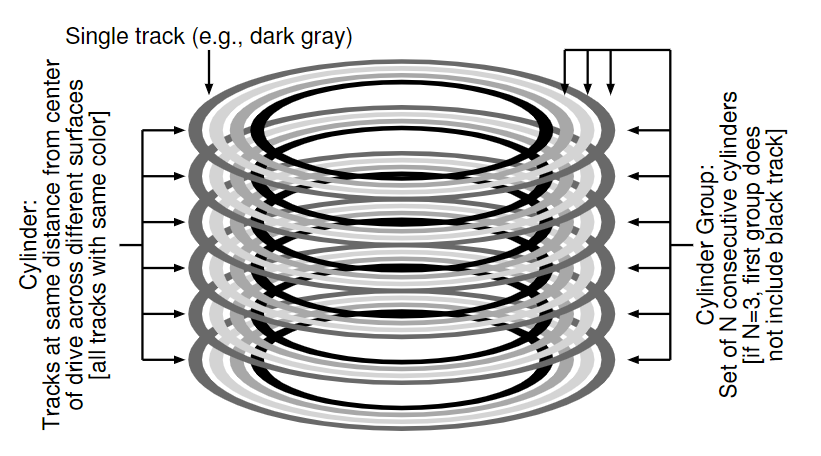
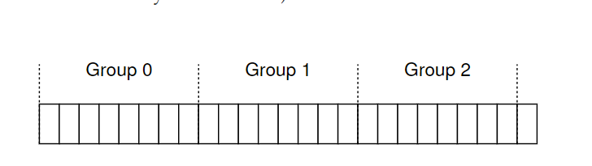
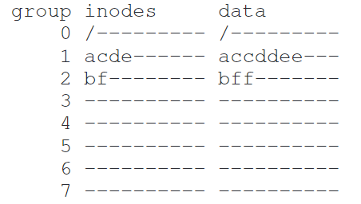
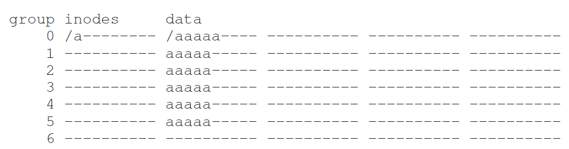
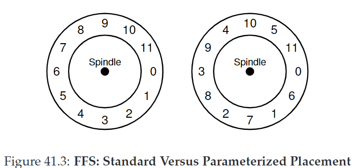

# 41. Locality and The Fast File System

古老的UNIX文件系统示意图：

## 41.1 The Problem: Poor Performance

早期的文件系统性能很糟糕，它将磁盘看作random-access memory，数据是分散的，导致高昂的positioning和seek开销，并且使得文件系统碎片化。

使用defragmentation工具可以转移磁盘数据，使文件连续放置。较小的block size有利于减少internal fragmentation，但是增加了positioning的开销。

CRUX：如何组织磁盘数据，以提高性能？

## 41.2 FFS: Disk Awareness Is The Solution

**Fast File System(FFS)**：设计”disk aware“的文件系统结构和分配策略。它保持了原来的接口不变，但是修改了内部的实现。

## 41.3 Organizing Structure: The Cylinder Group

第一步是改变磁盘的结构：FFS将磁盘分成一些cylinder groups，单个cylinder是硬盘驱动器不同表面上的一组磁道，距离驱动中心距离相同。

文件系统将驱动器组成成block groups，每个group由一块连续地址空间组成：

这些groups是FFS提高性能的关键：将两个文件放在相同的group，可以缩短seek时间

一个单独的cylinder group结构：

每个group都有一个**inode bitmap**(ib)和**data bitmap**(db)

## 41.4 Policies: How To Allocate Files and Directories

基本思想：*使相关联的东西放在一起，将不关联的东西分开。*

- 放置目录：找到分配目录数少、空闲inode多的cylinder group，将目录数据和inode放在该组。
- 放置文件：
  - 确保分配的data block和inode在同组，以缩短inode和data之间的seek时间。
  - 同目录下所有文件放在同组

例如对于三个目录（/, /a, /b）和四个文件（/a/c, /a/d, /a/e, /b/f），应如下放置：

## 41.6 The Large-File Exception

当一个文件过大时，会占据一个组大量空间，使得其他组空闲。

针对large-file exception，可以将文件分块（chunk），transfer到每个组：

分散文件会损害性能。通过选取合适的chunk大小，可以每次开销做更多工作，从而减少开销。这个过程称为**摊销（amortization）**

不过在FFS中，它采用如下方法：

- 前12个direct block（48KB）与inode放在同一组
- 后面的indirect block及指向的所有块都放在不同的组中。
- 若块大小为4KB，除了文件前48KB由direct pointer直接指向，每1024个块（4MB）都放在单独的组中

## 41.7 A Few Other Things About FFS

- FFS使用4KB block，虽然有利于转移数据，但会引起internal fragmentation。
  对应策略是**sub-blocks**，对于较小文件先放进sub-blocks，当数据大小达到4KB，再copy进4KB block。
  这个过程并不高效，因此实际上FFS采用的是通过修改libc库，缓冲writes，然后以4KB 块的形式将它们发送到文件系统。
- FFS对磁盘布局进行了优化这么做可以避免磁头转过头。利用**参数化（parameterization）**，FFS可以知道需要跳过多少个block，以避免额外旋转。此外FFS还会采用**track buffer**，再内部读取整个磁道并缓存。
- FFS是一个允许长文件名的文件系统。
- FFS引入了symbolic link，允许用户为系统上任何其他文件或目录创建别名，因此更灵活。
- FFS还引入了原子的rename()操作。

## 41.8 Summary

Certainly all modern systems account for the main lesson of FFS: **treat the disk like it’s a disk**.

