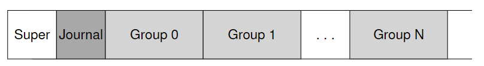
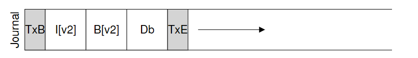
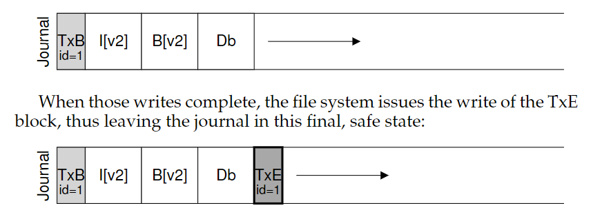
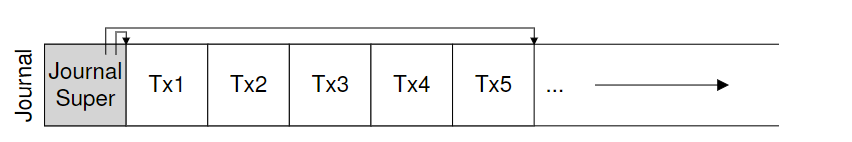
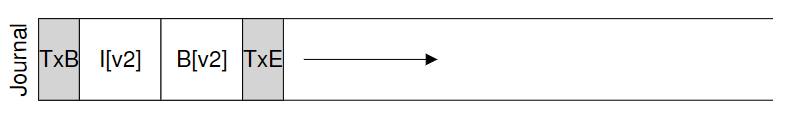
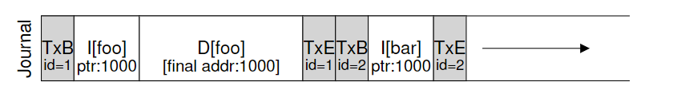
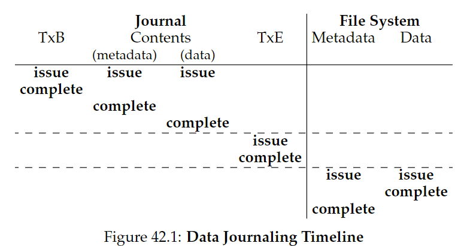
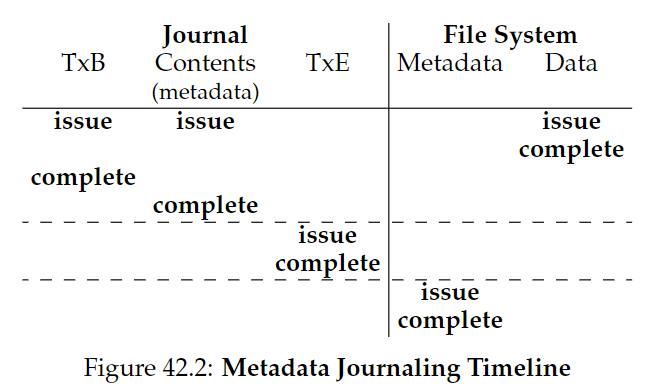

# 42. Crash Consistency: FSCK and Journaling

文件系统的数据结构必须是持久（persist）的。假如遇到设备断电或是系统崩溃，应该怎么办？对应的问题叫做：**crash-consistency problem**。

CRUX: how to update the disk despite crashes

本章将介绍两个方法，**file system checker（fsck）**和**journaling**（也叫**write-ahead logging**）

## 42.1 A Detailed Example

### Crash Scenarios

系统崩溃可能发生在以下情形：

只有一个写操作成功：

- 刚将数据块写入磁盘：数据在磁盘中，但是没有inode指向它，bitmap中不显示它已分配。这种情况不是一个file-system crash consistency问题。
- 刚将更新后的inode刚刚写入磁盘：inode指向磁盘地址，但是数据还没有写入。会读取garbage data。导致了**file-system inconsistency**问题。
- 刚将更新的bitmap写入磁盘：bitmap表示数据块已分配，但没有inode指向它。导致inconsistency，导致**space leak**。

两个写操作成功：

- inode和bitmap更新，但数据未写入磁盘：文件系统的metadata是完全consistent，但会导致garbage data。
- inode和data block写入，bitmap未写入：导致inode和旧版本的bitmap之间的inconsistency。
- bitmap和data block写入，inode未写入：同样导致inode和bitmap之间的inconsistency，不知道已分配的文件属于谁。

## 42.2 Solution #1: The File System Checker

a lazy approach: **fsck**，允许inconsistencies，之后再修复（当重启时）。它在文件系统被挂载并可用之前运行。

- **Superblock**：进行sanity check，例如确保文件系统大小比已分配的数据块数大。通常用于找到一个suspect superblock，让系统决定是否用一个备用副本。
- **Free blocks**：检查inodes, indirect blocks, double, indirect blocks等，看由哪些块分配到了文件系统上，信任inodes提供的信息生成一个正确的bitmap版本。
- **Inode state**：检查每一个inode，保证其type field合法（e.g., regular file, directory, symbolic link, etc.），如果发现suspect，将其清除，并相应更新bitmap。
- **Inode links**：从根目录其扫描整个目录树，为每个文件和目录计算自己的link counts，如果新计算的值与原值不一致，修复inode中的count。如果发现已分配的inode，但没有目录指向它，将它移到lost+found目录中。
- **Duplicates**：检查是否有重复指针指向同一个块，可以删除坏的，也可以复制一份数据块。
- **Bad blocks**：清除那些“坏的”指针（比如指向合法范围外的地址）
- **Directory checks**：检查目录内容，确保"."和".."是首先的两个entries，每个inode指向的entry都分配到了，没有目录在整个层次结构中被链接超过一次。

fsck缺点是太慢了，为了写入三个数据块竟然要检查整个磁盘，这是无法接受的。

## 42.3 Solution #2: Journaling (or Write-Ahead Logging)

基本思想：当更新磁盘时，在覆盖结构前，先记些笔记描述做了什么。写笔记即write ahead，写入一个结构即log。

当崩溃发生，可以回去检查记录再次尝试。

**Linux ext3**在ext2的基础上整合了日志系统：

### Data Journaling

TxB：事务开始，提供更新的相关信息（例如块I[v2]、B[v2]和Db 的最终地址），以及事务标识符（transaction identifier, **TID**）

中间的三个块称为physical logging，包含块本身内容。

TxE：事务结束，包含TID。

操作顺序：

1. **Journal write**：将事务（TxB、元数据和数据）写入日志，等待写入完成。
2. **Journal commit**：将事务提交块（包括TxE）写入日志，等待写入完成，事务被认为是committed
3. **Checkpoint**：将更新内容（元数据和数据）写入磁盘。

利用journal commit，防止Db写入前先调度写入了TxE。

### Recovery

- 如果崩溃发生在journal commit前：跳过待执行的更新。
- 如果崩溃发生在commit和checkpoint之间：系统启动时，文件系统扫描日志，查找已提交到磁盘的事务，按顺序被重放（replayed），再次尝试将事务中的块写入磁盘。称作**redo logging**。

### Batching Log Updates

一些文件系统不会一次一个地向磁盘提交每个更新（Linux ext3），而是将所有更新缓冲到全局事务中，最后一起写入磁盘，避免对磁盘的过多写入流量。

例如在一个目录下连续创建两个新项目，每次创建都会修改目录的inode和bitmap，先缓冲就只需要写入磁盘一次。

### Making The Log Finite

日志的大小是有限的，带来两个问题：

- 日志越满，恢复时间越长。
- 日志已满时，不能继续提交事务。

解决方案是使用循环数据结构**circular log**：

因此基础协议加上第四步：

4. **Free**：一段时间后，更新journal superblock，标记事务free。

### Metadata Journaling

我们每次写入数据，都要先写入日志，再写入磁盘，导致流量加倍。写入日志和写入主文件系统的寻道时间，也显著增加了开销。

Linux ext3使用的日志模式是data journaling。

一种更简单的日志模式叫ordered journaling，也叫metadata journaling，只把元数据写入日志，降低负载：

它的协议为：

1. **数据写入**：将数据写入最终位置，等待完成(optional)
2. **日志元数据写入**：将开始块和元数据写入日志，等待写入完成。 
3. **日志提交**：将事务提交块（包括TxE）写入日志，等待写完成，现在认为事务（包括数据）已提交（committed）。 
4. **加检查点元数据**：将元数据更新的内容写入文件系统中的最终位置。 
5. **释放**：稍后，在日志超级块中将事务标记为空闲。

1和2必须在3之前完成，防止出现一致性问题。但是2不必等待1完成才开始。

Core of crash consistency: "write the pointed-to object before the object that points to it".

### Tricky Case: Block Reuse

块的复用是一个棘手的问题：

如上图所示，对于一个metadata journaling，假设现在目录foo（地址1000处）创建一个文件，然后再将整个目录foo删除，之后恰好又在地址1000处创建新文件bar。

如果系统此时崩溃，replay过程中会向地址1000处写入目录数据，覆盖了文件bar中的用户数据。

在Linux ext3中，解决方案是当删除目录时，会写入一种叫**撤销（revoke）**的日志，replay时会首先扫描这些日志，避开这些被撤销的数据。

### Wrapping Up Journaling: A Timeline

日志过程的timeline如下（时间向下增长）

实际中每个写入的complete时间是任意的，取决于I/O子系统。只要虚线部分的顺序是强制的，以保证协议的正确性。

## 42.4 Solution #3: Other Approaches

- Soft Updates：规定写入顺序

- copy-on-write（COW）：不覆盖文件或目录；更新未使用位置

- backpointer-based consistency（BBC）：数据块有一个指回inode的指针

- optimistic crash consistency：利用事务校验（transaction
  checksum）

  

