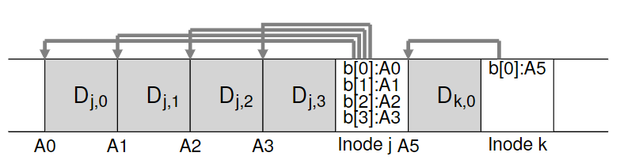
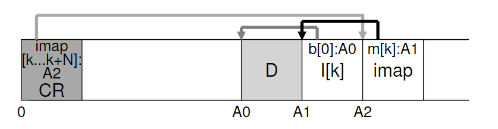

# 43. Log-structured File Systems

过去的文件系统存在以下问题：

- 内存大小不断增长。文件系统性能很大程度上取决于写入性能。
- 随机I/O 性能与顺序I/O 性能之间存在巨大的差距，且不断扩大：传输带宽每年增加约50%～100%。
- 现有文件系统在许多常见工作负载上表现不佳。
-  文件系统不支持 RAID。

Berkeley的教授引入了一种新的文件系统：**日志结构文件系统（Log-structured File System, LFS）**。写入磁盘时，LFS首先将所有更新（包括metadata）缓冲在in-memory **segment**，当segment已满，再顺序传输写入磁盘。LFS不会覆盖现有数据，始终将segment写入空闲位置。

CRUX：如何使所有写入变成顺序写入？

## 43.1 Writing To Disk Sequentially

basic idea：


数据块为4 KB，inode约128 bytes

## 43.2 Writing Sequentially And Effectively

单纯的顺序写入并不高效，因为磁盘旋转需要花时间。因此LFS采用**write buffering**，将更新先放入segment，一次性写入磁盘。

一个segment大约有几MB




## 43.3 How Much To Buffer?

写入越多，越接近达到峰值带宽。
$$
D=\frac{F}{1-F}\times R_{peak} \times T_{positions}
$$
$D$：缓冲大小（MB），$F$：峰值带宽，$R_{peak}$：磁盘传输速率（MB/s），$T_{positions}$：旋转和寻道开销

### 43.4 Problem: Finding Inodes

LFS中查找inode很麻烦，因为inode在磁盘中是分散分布的，而且因为我们不能覆盖原有数据，因此最新版本的inode会不断移动。

### 43.5 Solution Through Indirection: The Inode Map

LFS的解决方案是引入**间接层（level of indirection）**，一种叫做**inode map(imap)**的数据结构。

它放在写入所有其他信息的位置旁边：


在该图中，imap 数组存储在标记为 imap 的块中，它告诉 LFS，inode  k 位于磁盘地址A1。接下来，这个inode 告诉LFS 它的数据块D 在地址A0。

## 43.6 Completing The Solution: The Checkpoint Region

LFS有一块固定位置叫做**checkpoint region（CR）**，包含指向最新inode map的指针。

CR只会周期性地更新（比如30s），不会很影响性能



## 43.7 Reading A File From Disk: A Recap

假设内存中没有任何东西，要读取一个文件：

1. 首先检查CR，CR中包含指向整个inode map的指针。LFS读取整个inode map，并缓存入内存。
2. 给定文件的inode number，LFS查询imap，读取最新版本的inode。
3. 有了inode，然后和UNIX文件系统一样，使用直接指针/间接指针/双重间接指针，读取数据块。

## 43.8 What About Directories?

LFS对于目录的处理和经典UNIX文件系统一样，目录只是一系列映射的集合。


任何不是原地更新的文件系统都会遇到**递归更新问题（recursive update problem）**：当一个inode被更新，它在磁盘上的位置改变，意味着指向它的目录也要更新，以此类推，一路沿着文件系统树向上更新。

LFS巧妙避免了这个问题：即使文件的inode位置变化，变化不会反映在目录本身中。imap结构被更新，而目录保持相同的name-to-inode-number mapping（例如上图中的(foo, k)）

## 43.9 A New Problem: Garbage Collection

如果是简单覆盖数据块，LFS保留旧版本：


如果是在原始文件中添加一块，新的inode则还会指向旧的数据块：


如何处理旧版本的inode、数据块？

可以保留并允许用户恢复旧版本文件，这种文件系统叫做**版本控制文件系统（versioning file system）**

但是LFS只保留最新版本的文件，必须周期性地清理这些旧版本。这一过程叫做**垃圾回收（garbage collection）**，在许多编程语言中得到运用，用于自动释放未使用的内存。

如果只是简单地释放单个数据块，会导致磁盘出现空闲洞，损害写入性能。

LFS采取的策略是segment-by-segment basis，清理大块空间：

1. LFS cleaner周期性地读取一系列旧的segment（只使用了部分的），确定其中哪些块是活的（live）
2. 然后将这些活的块打包，写入新开辟的segment，释放掉老的segment。

现在有两个问题：第一，怎么判断哪些是活的？第二，多久清理一次，以及清理哪些部分？

## 43.10 Determining Block Liveness

决定块的死活：

每个segment头部保留一块**segment summary block**：

对于地址A处的数据块，summary中存有它的inode number N和offset T。利用N读取imap，找到inode；利用T读取inode，找到指向数据块的指针。如果指针指向A，说明该块是活的；如果指针指向别处，说明块是死的。

```pseudocode
(N, T) = SegmentSummary[A];
inode = Read(imap[N]);
if (inode[T] == A)
	// block D is alive
else
	// block D is garbage
```


一些捷径：如果文件被裁断或者删除，LFS增加其**版本号**，将新版本号记录在imap中。这样只要对比新版本号和磁盘上的版本号是否一致。

## 43.11 A Policy Question: Which Blocks To Clean, And When?

确定清理哪些块是一个有挑战性的问题。最初的论文中提出的方法是冷热分离：热segment经常被覆盖，应等待较长时间后再清理。冷segment存在一些死块，但其余内容相对稳定，应尽快清理。

## 43.12 Crash Recovery And The Log

- 每个segment都存储了下一个 Segment 的地址，整个文件系统像链表一样组织在一起：
- 在CR中，LFS 存储了这个链表的第一个segment 和最后一个segment 的地址，因此只要读取CR就能恢复出整个文件系统。
- LFS 每 30秒更新一次CR中的数据。


对于CR更新的原子性保证：

LFS保留两个CR，分别位于磁盘两端，并交替写入。每次更新CR时，首先写出一个带时间戳的头，然后写出CR主体，最后写出带时间戳的尾。如果更新CR时系统崩溃，可以通过检查时间戳的不一致来检测到。

对于segment更新的原子性保证：

重启时，LFS读取CR、它指向的imap以及后续文件和目录，从而恢复。但是因为每隔30s才更新一次CR，仍有几秒的更新丢失。

改进办法是**roll forward**，从当前的 segment 链表尾部向后，恢复已经成功写入但没有被checkpoint的数据。

## 43.13 Summary

LFS引入了一种更新磁盘的新办法：总是写入磁盘未使用部分，通过清理回收旧空间，而不覆盖原有文件。在数据库系统中叫做**shadow paging**，文件系统中叫做**copy-on-write**，实现了高效写入。
