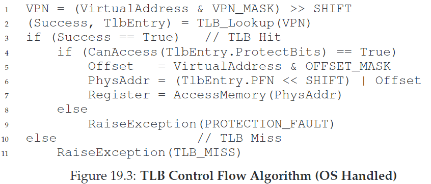
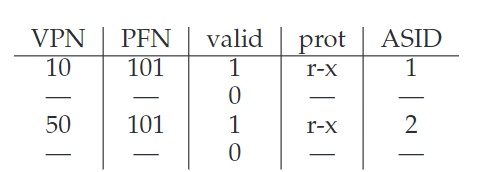

# 19. Paging: Faster Translations (TLBs)

CRUX：如何加速地址转换？

使用**转换后备缓冲区（translation-lookaside buffer, TLB）**。它是MMU的一部分，是一种cache，因此也叫**address-translation cache**。

## 19.1 TLB Basic Algorithm

```
VPN = (VirtualAddress & VPN_MASK) >> SHIFT
(Success, TlbEntry) = TLB_Lookup(VPN)
if (Success == True)	// TLB Hit
	if (CanAccess(TlbEntry.ProtectBits) == True)
		Offset = VirtualAddress & OFFSET_MASK
		PhysAddr = (TlbEntry.PFN << SHIFT) | Offset
	else
		RaiseException(PROTECTION_FAULT)
else					// TLB Miss
	PTEAddr = PTBR + (VPN * sizeof(PTE))
	PTE = AccessMemory(PTEAddr)
	if (PTE.Valid == False)
		RaiseException(SEGMENTATION_FAULT)
	else if (CanAccess(PTE.ProtectBits) == False)
		RaiseException(PROTECTION_FAULT)
	else
		TLB_Insert(VPN, PTE.PFN, PTE.ProtectBits)
		RetryInstruction()
```

## 19.2 Example: Accessing An Array


假设我们有一个大小为10的数组，它在地址空间的分布如上图所示。用以下代码求数组的和：

```c
int sum = 0;
for (i = 0; i < 10; i++)
	sum += a[i];
```

首先访问a\[0]，硬件检查VPN=06，得到**TLB miss**。TLB将所有VPN=06的数载入缓存，因此之后访问a\[1],a\[2]都会得到**TLB hit**。以此类推。最后得到**hit rate** = 70%。这一优化过程利用了**空间局部性（spatial locality）**，元素在内存空间中连续分布。

循环过后如果我们再次访问数组中的每个元素，得到的hit rate就为100%。这利用了**时间局部性（temporal locality）**，重复引用已经被访问的元素。

## 19.3 Who Handles The TLB Miss?

谁来处理TLB miss？

* **Complex Instruction Set Computing（CISC）**：由硬件处理，通过page table base register定位到page table的位置，从中找到正确的entry，抽取转换，更新TLB。
* **Reduced Instruction Set Computing（RISC）：**由OS处理，使用trap handler
  * 普通的return-from-trap指令回到下条指令，而TLB miss handler会回到触发trap的指令并retry。
  * 防止TLB miss无限连锁触发：OS将TLB miss handlers放进物理内存（unmapped，不受制于地址转换）；或者在TLB中保留一些entry作为永久有效的转换，并将其中一些translation slots用作handler自己，称作为wired translation



ASIDE: TLB Valid Bit ≠ Page Table Valid Bit TLB中的valid bit用于标识一个entry是否有一个valid translation。系统启动和上下文切换时，会把所有的entry置为invalid。

## 19.4 TLB Contents: What’s In There?

A TLB entry migh look like this:

VPN | PFN | other bits

## 19.5 TLB Issue: Context Switches

一个TLB只对当前运行中的进程有意义，因此进程切换时，必须保证新的进程不能用到旧的TLB

CRUX：上下文切换时如何管理TLB内容

Solutions：

* flush TLB，直接置0。但是代价较高。
* **address space identifier(ASID)**：8bits的ASID类似于32bits的PID
  * 允许两个进程共享一张page
  * 

## 19.6 Issue: Replacement Policy

CRUX：如何设计TLB替换策略

* LRU
* random

## 19.7 A Real TLB Entry

如图所示是一个MIPS TLB Entry

* 19-bit VPN，24-bit PFN，支持64GB主存的系统（2^24 4KB pages）
* G: global bit，用于标识是否为全局共享page，如果为1则ASID会被忽略
* 8-bit AISD
* C: coherence bit，标识page如何被硬件缓存
* D: dirty bit
* V: valid bit

MIPS TLB通常有32或64个这样的entry，大部分用于user process运行，小部分为OS保留。

四个privileged指令：TLBP,TLBR,TLBWI,TLBWR
