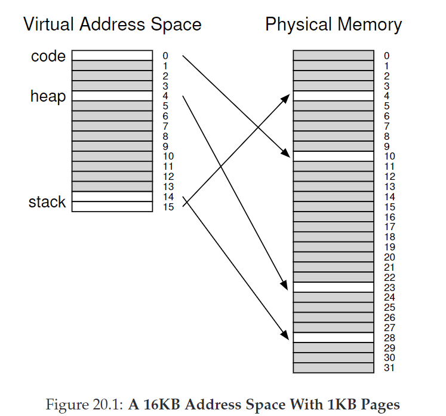
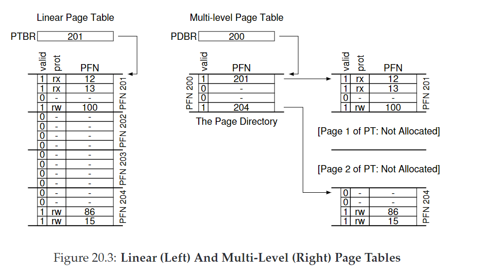
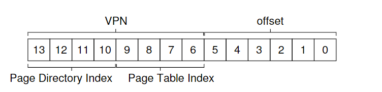

# 20. Paging: Smaller Tables

对于32-bit的地址空间，4KB的页和4byte的entry，一个进程的page table需要$$2^{32}/2^{12}×2^2=2^{22}byte=4MB$$，这太大了。

CRUX：如何让page table更小？

## 20.1 Simple Solution: Bigger Pages

一个简单的思路是用更大的页，这样页数变少，页表也变小。但更大的页意味着会造成内部碎片。

ASIDE：现在许多架构（e.g.,MIPS,SPARC,X86-64）支持多种page size，但这使得OS内存管理非常复杂。

## 20.2 Hybrid Approach: Paging and Segments

分段+分页混合使用。每个逻辑分段（code, heap, stack）都有一个单独的页表

&#x20;

heap和stack中间未使用的空间不再会被分配内存，因此节省了page table的空间。

然而缺点是不够灵活，因为它规定了一块地址空间的使用模式；而且分段的方法使page table大小可变，重新产生了外部碎片。

## 20.3 Multi-level Page Tables

多级页表把线性页表转化成树结构，添加一层**page directory**来管理多个页面，如果一个page directory entry(**PDE**)对应的页都没有使用，则不分配管理，也就没有相应的PTE，从而大大减小了页表大小。

分级方法是将VPN的前4位（32位内存）划分为**page directory index**

PTEAddr = (PDE.PFN << SHIFT) + (PTIndex \* sizeof(PTE))

如果要分更多的级，每组index的位数 = log(page size / PTE size)

## 20.4 Inverted Page Tables

一个极端的方法，只保留一张单页表与物理页一一对应。这种情况下搜索的复杂度才是关键。

inverted page tables也说明了页表本质是数据结构。

## 20.6 Summary

在有限内存系统中，小型页表更好。在内存较大且频繁使用大量也的系统中，大的页表并能加速处理TLB miss的更好。
