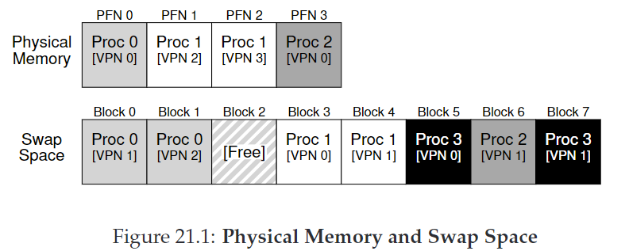

# 21. Beyond Physical Memory: Mechanisms

我们之前假设每个进程的地址空间都能fit进内存，现在我们要relax这个假设，我们希望支持许多并发运行的大地址空间。

为了实现这个目标，我们需要引入：**内存层次（memory hierarchy）**。OS需要将一部分需求量不大的地址空间藏起来。这个地方是**硬盘驱动器（hard disk drive）**，它体积更大，但也更慢。

CRUX：如何超越物理内存？

## 21.1 Swap Space

我们在磁盘中保留了一一块叫做**交换区（swap space）的地方，OS可以将内存中的页交换进去，或从其中交换出来。OS需要记住每个页对应的磁盘地址（disk address）**。



如上图这个例子，内存中有4页，交换区中有8页。进程0，1，2共享着物理内存，同时还有一部分页保留在磁盘交换区。进程3所有的页都在磁盘，说明不在运行。

## 21.2 The Present Bit

我们先来回顾一下内存引用的过程：进程生成虚拟地址，硬件抽取VPN，检查TLB匹配，若hit，得到物理地址；若miss，检查页表，以VPN作索引搜索对应PTE，若page is valid，存在于物理内存，硬件抽取PFN，将其install到TLB，retry指令，得到TLB hit。

现在因为我们引入了交换区，PTE中需要有一块新的信息区**present bit**，如果置1，硬件得知对应page存在于物理内存，一切照旧；如果置0，说明page在磁盘中，抛出**page fault**，OS接手，用**page-fault handler**处理。

## 21.3 The Page Fault

不论是hardware-managed TLBs还是soft-ware managed TLBs，page fault都由OS处理。

OS用PTE中的PFN向磁盘交换区查找，发起I/O请求。当I/O完成，OS更新页表，标记该页为present，更新PFN以记录新取的页的内存位置，retry指令，得到TLB miss，更新TLB（处理page fault后更新TLB来避免这步）。最终，TLB hit。

注意，I/O进行中时，该进程会处于**阻塞（blocked）状态。因此OS可以运行其他进程。也就是overlap**。

## 21.4 What If Memory Is Full?

若内存已满，OS需要将一些page交换出去，如何选择？需要用到**page-replacement policy**，将在下章具体探讨。

## 21.5 Page Fault Control Flow

* Page-Fault Control Flow Algorithm (Hardware)

```
VPN = (VirtualAddress & VPN_MASK) >> SHIFT
(Success, TlbEntry) = TLB_Lookup(VPN) 
if(Success == True) // TLB Hit
    if (CanAccess(TlbEntry.ProtectBits) == True)
        Offset   = VirtualAddress & OFFSET_MASK
        PhysAddr = (TlbEntry.PFN << SHIFT) | Offset
        Register =AccessMemory(PhysAddr)
    else
        RaiseException(PROTECTION_FAULT)
else                  // TLB Miss
    PTEAddr = PTBR + (VPN*sizeof(PTE))
    PTE =AccessMemory(PTEAddr)
    if (PTE.Valid == False)
        RaiseException(SEGMENTATION_FAULT)
    else 
        if (CanAccess(PTE.ProtectBits) == False)
            RaiseException(PROTECTION_FAULT)
        else if (PTE.Present == True)// assuming hardware-managed TLB
            TLB_Insert(VPN, PTE.PFN, PTE.ProtectBits)
            RetryInstruction()
        else if (PTE.Present == False)
            RaiseException(PAGE_FAULT)
```

* Page-Fault Control Flow Algorithm (Software)

```
PFN = FindFreePhysicalPage()
if(PFN == -1) // no free page found
    PFN = EvictPage()       // run replacement algorithm
DiskRead(PTE.DiskAddr, PFN)// sleep (waiting for I/O)
PTE.present = True          // update page table with present
PTE.PFN     = PFN           // bit and translation (PFN)
RetryInstruction()          // retry instruction 
```

## 21.6 When Replacements Really Occur

为了保证始终有少量内存空闲，OS会设置高水位线（HW）和低水位线（LW），当可用页数少于LW，启动**守护线程（swap daemon）**来释放页，直到可用页数为HW。

许多系统还会聚集（cluster）一些页来同时交换，以优化性能。

## 21.7 Summary

以上所有工作对于进程都是透明的！
