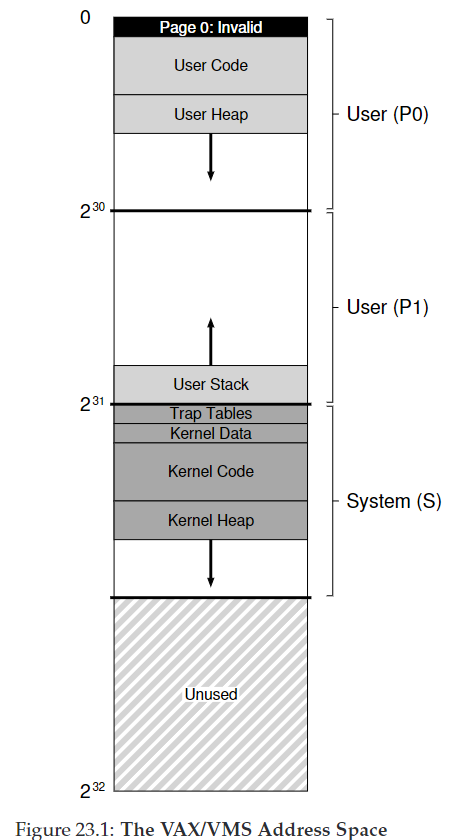
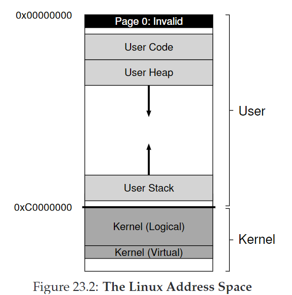
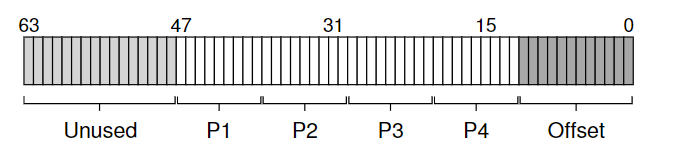

# 23. Complete Virtual Memory Systems

CRUX：如何构建一个完整的VM系统？

## 23.1 VAX/VMS Virtual Memory

### A Real Address Space

VAX-11提供32-bit地址空间，分成512-byte页。因此一个虚拟地址由23-bit VPN和9-bit offset组成。VPN高二位用于区分段。因此是hybrid of paging and segmentation。

主要问题：页很小（512bytes），页表存放压力大。

解决方案：

1. 将用户地址空间分成两段，P0和P1；堆栈间未使用的地址不会被分配。
2. 将用户页表（P0/P1各一张）放入kernel虚拟内存S。如果内存压力过大，kernel会把一些页交换进disk。
3. 利用TLB缓存。

NOTE：

1. 代码段不从page 0开始。page 0被标记为不可访问，用于检测null-pointer。
2. kernel的虚拟地址空间属于每一个user地址空间。上下文切换时，P0和P1寄存器会指向soon-to-be-run进程，但是不会改变S的base and bound寄存器，从而实现将同一个kernel结构映射到每一个user地址空间。这种设计使复制数据更容易。
3. page table设有protection bits来规定权限。

### Page Replacement

PTE组成：1 valid bit + 4 protection bits + 1 dirty bit + 5 bits for OS + PFN

问题：

1. 没有reference bit！因此VMS的替换算法必须在没有硬件支持下进行。
2. 一些程序占用大量内存，影响其他程序

解决方案：

1. **segmented FIFO**：给每一个进程规定**resident set size（RSS）**，即最大可存放页数。超过这个值就会按FIFO驱逐页。
2. 为了提升FIFO效率，引进**second-chance lists**，即全局的clean-page free list和dirty-page list。当进程P超过RSS，一张页被驱逐，如果没有被修改（clean），放入clean-page list末，否则放入dirty-page list末。当进程Q需要一张free page，先从clean list首取页。如果P在回收那张页时触发fault，P会从dirty list中回收，从而避免磁盘访问开销。
3. 采用clustering方法，大批量组合dirty list中的页，一次性写入磁盘（并使它们clean），从而提高I/O效率。

### Other Neat Tricks

介绍两个**lazy optimizations**：

* **demanding zeroing**：**按需置零**。当页被载入地址空间，会在页表中标记其位inaccessible。如果一个进程读/写该页，触发trap，OS找到对应物理地址，将其归零。如果进程永远不访问该页，就不需要做这些工作。
* **copy-on-write, COW**：当OS需要把一张页的数据复制到另一个地址空间，不需要直接复制，而是映射到目标地址空间，并标记为read-only。如果两个空间都只用read，那么什么也不用做了。如果其中一个进程想要write，触发trap，OS分配一个新页，填充数据并映射到触发trap的地址空间中。这个机制在UNIX系统中尤其重要，fork(), exec()。

以上两个方法的核心思想就是**be lazy**，一方面提高了responsiveness，另一方面避免了可能做多余的工作。

## 23.2 The Linux Virtual Memory System

Intel x86架构下的Linux虚拟内存系统：

### The Linux Address Space

Linux的地址空间，特点在于：

* **kernel logical addresses：**
  * 使用kmalloc获得更多空间。用于存放kernel数据结构，如页表、per-process kernel stacks等。不能被交换到磁盘。
  * 直接映射到物理内存。（0xC0000000 -> 0x00000000）。好处：（1）容易转换（2）地址连续，适合**directory memory access（DMA）**
* **kernel virtual address：**
  * 使用vmalloc。
  * 不连续，不适合DMA。容易分配，用于large buffers。能够在32-bit Linux中分配超过1GB内存。

### Page Table Structure

Linux x86采用64位地址空间，采用四级页表。

底12位为offset（4KB page）；中间36位为VPN，分4级；高16位未使用。

### Large Page Support

Linux允许应用利用huge pages（2-MB and even 1-GB pages）。

* 使用更少的TLB slots，提高TLB hit rate；同时减少应对TLB miss的开销。
* **Incrementalism：**Linux起初只允许很少的应用（如大型数据库）申请huge pages，用显示请求mmap()或shmget()；近来Linux添加transparent huge page support。
* 缺点：内部碎片internal fragmentation；swapping慢。

### The Page Cache

* Linux page cache是**统一**的，有三个主要来源：**memory-mapped files**，file data and metadata from devices，heap and stack that comprise each process（也叫**匿名内存，anonymous memory**）。这些实体存储在**page cache hash table**中。
* 记录clean/dirty。dirty data会周期性被background thread（pdflush）写回持久化存储。
* 使用**2Q**替换算法：
  * 维护两个list，**inactive list** and **active list**。一张页被第一次访问加入inactive list，被重新引用时放入active list。
  * 需要替换时，先驱逐inactive list中的页。
  * Linux周期性地将active list底的页放入inactive list，保持active list页数位总页数的2/3。

### Security And Buffer Overflows

* **buffer overflow**：恶意代码通过缓冲区溢出来获得previlige escalation。对策：**NX bit**（No-eXecute）
* **return-oriented programming(ROP)**：攻击者覆盖栈区，使返回地址指向一个恶意指令。对策：**address space layout randomization(ASLR)**。随机化堆栈地址。
  * ASLR也被整合进kernel，称为KASLR。

## Other Security Problems: Meltdown And Spectre

CPU会采用speculative execution来预测即将执行的指令。这暴露了内存信息。

对策：**kernel page table isolation，KPTI**，不把整个kernel映射到每个process，只保留最低要求的，切换到kernel时需要切换到kernel page table。但是会影响性能。

## 23.3 Summary

> What is any ocean, but a multitude of drops?
>
> ——Cloud Atlas
